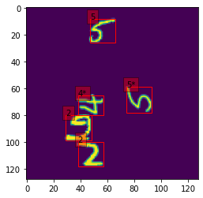

Neural network which given an image with plain background and MNIST digits randomly placed on it (possibly rotated) it recognizes digit value, its rotation and placement on the image:

Obtained 44% accuracy.